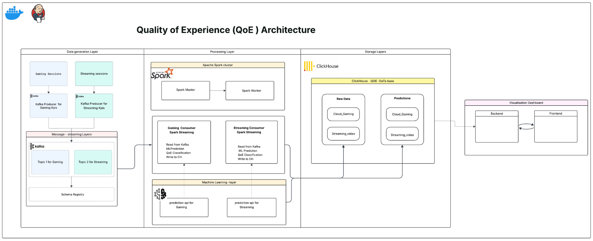
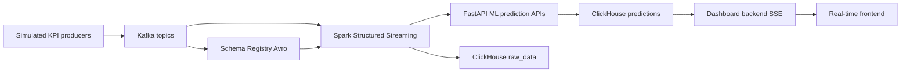

# QoE Analysis Platform

A real-time Quality of Experience (QoE) collection, prediction, and visualization platform for two use cases:

- Cloud Gaming
- Video Streaming

The project simulates KPI streams, publishes them to Kafka with Avro schemas, processes them with Spark Structured Streaming, calls FastAPI-based ML prediction services, stores raw data and predictions in ClickHouse, and displays the results in a real-time web dashboard.

## Architecture



Logical project flow:



## Features

- Continuous KPI generation for Cloud Gaming and Video Streaming.
- Avro serialization with Confluent Schema Registry.
- Dedicated Kafka topics:
  - `cloud_gaming_kpi`
  - `video_streaming_kpi`
- Streaming processing with Spark.
- QoE prediction APIs exposed with FastAPI.
- ML models trained with scikit-learn and saved as `.pkl` artifacts.
- ClickHouse storage with two layers:
  - `raw_data` for raw KPI records.
  - `predictions` for predicted QoE scores.
- Real-time web dashboard with Server-Sent Events (SSE), Chart.js, light/dark mode, and QoE degradation alerts.
- Docker Compose environment for Kafka, Schema Registry, Spark, ClickHouse, APIs, and dashboard services.
- Kubernetes kind manifests for local dashboard deployment.
- Jenkins pipeline for tests, Docker image builds, and kind deployment.

## Repository Structure

```text
.
|-- api/
|   |-- cloud_gaming/          # FastAPI prediction API for Cloud Gaming
|   `-- video_streaming/       # FastAPI prediction API for Video Streaming
|-- app/
|   |-- backend/               # Dashboard backend, SSE, and ClickHouse reads
|   `-- frontend/              # HTML/CSS/JS dashboard served by Nginx
|-- data_ingestion/            # Kafka producers and Avro schemas
|-- data_pipeline/consumers/   # Spark Structured Streaming consumers
|-- infrastructure/
|   |-- docker/                # Docker Compose files and ingestion Dockerfile
|   `-- kind/                  # Kubernetes kind configuration
|-- ml/
|   |-- config/                # YAML dataset and model configurations
|   |-- data/                  # CSV datasets
|   |-- evaluation/            # Model evaluation and best-model selection
|   |-- models/                # Trained model artifacts
|   `-- training/              # Unified training script
|-- storage/                   # ClickHouse initialization SQL scripts
|-- tests/                     # pytest unit tests
|-- Jenkinsfile                # CI/CD pipeline
`-- README.md
```

## Tech Stack

| Layer | Technologies |
| --- | --- |
| Ingestion | Python, Confluent Kafka Producer, Avro, Schema Registry |
| Messaging | Apache Kafka in KRaft mode |
| Streaming | Apache Spark 3.5 Structured Streaming |
| Machine Learning | pandas, scikit-learn, joblib |
| APIs | FastAPI, Uvicorn, Pydantic |
| Analytical storage | ClickHouse |
| Dashboard | HTML, CSS, JavaScript, Chart.js, Lucide Icons, SSE |
| Containerization | Docker, Docker Compose |
| Local orchestration | kind, Kubernetes, kubectl |
| CI/CD | Jenkins |
| Tests | pytest, FastAPI TestClient |

## Data and ML Features

### Cloud Gaming

Dataset: `ml/data/simulated_4k_cloud_gaming_dataset.csv`

- Number of examples: 1000
- Target: `QoE_score`
- Features:
  - `CPU_usage`
  - `GPU_usage`
  - `Bandwidth_MBps`
  - `Latency_ms`
  - `FrameRate_fps`
  - `Jitter_ms`

QoE classes:

| Score | Class |
| --- | --- |
| `< 2` | Poor |
| `>= 2` and `< 3` | Fair |
| `>= 3` and `< 4` | Good |
| `>= 4` | Excellent |

### Video Streaming

Dataset: `ml/data/video - streaming.csv`

- Number of examples: 20411
- Target: `mos`
- Features:
  - `throughput`
  - `avg_bitrate`
  - `delay_qos`
  - `jitter`
  - `packet_loss`

QoE classes:

| Score | Class |
| --- | --- |
| `< 2` | Bad |
| `>= 2` and `< 3` | Poor |
| `>= 3` and `< 4` | Fair |
| `>= 4` and `< 4.5` | Good |
| `>= 4.5` | Excellent |

## Requirements

- Python 3.11 or newer
- Docker
- Docker Compose v2
- Git
- For local Kubernetes:
  - kind
  - kubectl
- For Jenkins:
  - Jenkins with access to Docker, kind, and kubectl

## Local Python Setup

From the repository root:

```bash
python -m venv .venv
source .venv/bin/activate
pip install --upgrade pip
pip install -r requirements.txt
```

For test dependencies only:

```bash
pip install -r requirements.dev.txt
```

## Model Training and Evaluation

The `ml/training/train.py` script trains multiple models for a selected dataset:

- Linear Regression
- ElasticNet
- Random Forest Regressor
- Gradient Boosting Regressor

Train Cloud Gaming models:

```bash
python -m ml.training.train --config cloud_gaming
```

Train Video Streaming models:

```bash
python -m ml.training.train --config video_streaming
```

Evaluate models and keep the best one according to RMSE:

```bash
python -m ml.evaluation.evaluate --config cloud_gaming
python -m ml.evaluation.evaluate --config video_streaming
```

The final models expected by the APIs are:

- `ml/models/cloud_gaming_model.pkl`
- `ml/models/video_streaming_model.pkl`

Note: the evaluation script saves the best model using the configured final name and deletes the other candidate model files for the same dataset.

## Running with Docker Compose

The Compose files use the external Docker network `app-tier`. Create it once before starting the services:

```bash
docker network create app-tier
```

If the network already exists, you can ignore the error.

### 1. Start ClickHouse

```bash
docker compose -f infrastructure/docker/docker-compose.clickhouse.yaml up -d
```

The SQL scripts in `storage/` are mounted into `/docker-entrypoint-initdb.d` and automatically create:

- `raw_data.cloud_gaming_raw`
- `raw_data.video_streaming_raw`
- `predictions.cloud_gaming_predictions`
- `predictions.video_streaming_predictions`

### 2. Start Kafka, Schema Registry, and Producers

```bash
docker compose -f infrastructure/docker/docker-compose.kafka.yaml up -d --build
```

Main services:

- Kafka: `kafka-0-s:9092`
- Schema Registry: `http://schema-registry:8081`
- Kafka UI: `http://localhost:8088`
- Local Schema Registry: `http://localhost:9081`

The `kafka-producer` service creates the topics and publishes one message per second for each use case.

### 3. Start the Prediction APIs

```bash
docker compose -f infrastructure/docker/docker-compose.api.yaml up -d --build
```

Local endpoints:

- Cloud Gaming API: `http://localhost:8001`
- Video Streaming API: `http://localhost:8002`

Swagger documentation:

- `http://localhost:8001/docs`
- `http://localhost:8002/docs`

### 4. Start Spark and Streaming Consumers

```bash
docker compose -f infrastructure/docker/docker-compose.spark.yaml up -d
```

Useful services:

- Spark Master UI: `http://localhost:8083`
- Spark Worker UI: `http://localhost:8082`
- Cloud Gaming Spark UI: `http://localhost:4040`
- Video Streaming Spark UI: `http://localhost:4041`

The Spark consumers read from Kafka, deserialize Avro records, write raw KPIs to ClickHouse, call the prediction APIs, and store the predictions.

### 5. Start the Dashboard

```bash
docker compose -f infrastructure/docker/docker-compose.app.yaml up -d --build
```

Dashboard:

```text
http://localhost:8080
```

The Nginx frontend proxies `/api/` to the dashboard backend. The backend exposes these SSE streams:

- `/api/stream/cloud-gaming`
- `/api/stream/video-streaming`

## URLs and Ports

| Service | Local URL | Description |
| --- | --- | --- |
| Dashboard | `http://localhost:8080` | Real-time interface |
| Dashboard backend | internal Docker `backend:8000` | SSE streams from ClickHouse |
| Cloud Gaming API | `http://localhost:8001` | Cloud Gaming QoE prediction |
| Video Streaming API | `http://localhost:8002` | Video Streaming QoE prediction |
| Kafka UI | `http://localhost:8088` | Kafka inspection |
| Schema Registry | `http://localhost:9081` | Avro schemas |
| ClickHouse HTTP | `http://localhost:8123` | ClickHouse HTTP API |
| ClickHouse UI | `http://localhost:5521` | ClickHouse interface |
| Spark Master | `http://localhost:8083` | Spark cluster |
| Spark Worker | `http://localhost:8082` | Spark worker |

Development ClickHouse credentials:

```text
user: qoe_user
password: qoe_password
```

## Prediction APIs

### Cloud Gaming

Health check:

```bash
curl http://localhost:8001/health
```

Prediction:

```bash
curl -X POST http://localhost:8001/predict \
  -H "Content-Type: application/json" \
  -d '{
    "CPU_usage": 50,
    "GPU_usage": 40,
    "Bandwidth_MBps": 25.5,
    "Latency_ms": 35,
    "FrameRate_fps": 60,
    "Jitter_ms": 3
  }'
```

Response:

```json
{
  "qoe_score": 3.7,
  "qoe_class": "Good"
}
```

### Video Streaming

Health check:

```bash
curl http://localhost:8002/health
```

Prediction:

```bash
curl -X POST http://localhost:8002/predict \
  -H "Content-Type: application/json" \
  -d '{
    "throughput": 2000,
    "avg_bitrate": 1500,
    "delay_qos": 50,
    "jitter": 5,
    "packet_loss": 0
  }'
```

Response:

```json
{
  "qoe_score": 4.6,
  "qoe_class": "Excellent"
}
```

## ClickHouse Schema

The project creates two main databases:

- `raw_data`
- `predictions`

Raw tables:

- `raw_data.cloud_gaming_raw`
- `raw_data.video_streaming_raw`

Prediction tables:

- `predictions.cloud_gaming_predictions`
- `predictions.video_streaming_predictions`

The tables use the `MergeTree` engine, are partitioned by month with `toYYYYMM(ingestion_timestamp)`, and are ordered by `(ingestion_timestamp, id)`.

## Kubernetes Deployment with kind

The `infrastructure/kind/` directory contains a local kind configuration and dashboard manifests.

Create the cluster:

```bash
kind create cluster --name qoe --config infrastructure/kind/kind-config.yaml
```

Build the dashboard images:

```bash
docker build -t qoe/dashboard-backend:dev ./app/backend
docker build -t qoe/dashboard-frontend:dev ./app/frontend
```

Load the images into kind:

```bash
kind load docker-image qoe/dashboard-backend:dev --name qoe
kind load docker-image qoe/dashboard-frontend:dev --name qoe
```

Deploy:

```bash
kubectl create namespace qoe
kubectl apply -f infrastructure/kind/app/backend.yaml
kubectl apply -f infrastructure/kind/app/frontend.yaml
```

Access the frontend:

```bash
kubectl port-forward -n qoe svc/frontend 8090:80
```

URL:

```text
http://localhost:8090
```

The `port.sh` script also starts this port-forward.

## Tests

Run the tests:

```bash
pytest
```

The tests cover:

- Loading ML configurations.
- Creating supported model types.
- Mapping QoE scores to classes.
- The `/health` and `/predict` API endpoints.
- Pydantic validation for API payloads.

## Jenkins CI/CD

The `Jenkinsfile` runs these stages:

1. Tool checks (`docker`, `kind`, `kubectl`).
2. GitHub repository checkout.
3. Python virtual environment creation.
4. Test dependency installation.
5. `pytest tests/` execution.
6. Dashboard backend and frontend Docker image builds.
7. Image loading into the kind cluster.
8. Kubernetes deployment into the `qoe` namespace.
9. Pod and service verification.
10. Email notification on success or failure.

## Important Configuration

Variables and paths used by the services:

| Item | Default value |
| --- | --- |
| Cloud Gaming model | `/app/models/cloud_gaming_model.pkl` |
| Video Streaming model | `/app/models/video_streaming_model.pkl` |
| API model variable | `MODEL_PATH` |
| Internal Kafka bootstrap | `kafka-0-s:9092` |
| Internal Schema Registry | `http://schema-registry:8081` |
| Internal ClickHouse | `clickhouse:8123` |
| Dashboard backend ClickHouse | `host.docker.internal:8123` |
| ClickHouse raw database | `raw_data` |
| ClickHouse predictions database | `predictions` |

## Stopping Docker Services

Stop the Compose stacks:

```bash
docker compose -f infrastructure/docker/docker-compose.app.yaml down
docker compose -f infrastructure/docker/docker-compose.spark.yaml down
docker compose -f infrastructure/docker/docker-compose.api.yaml down
docker compose -f infrastructure/docker/docker-compose.kafka.yaml down
docker compose -f infrastructure/docker/docker-compose.clickhouse.yaml down
```

To remove persistent volumes as well, add `-v` to the `down` commands.

## Development Notes

- The included ClickHouse credentials are intended for local development.
- The producers generate random synthetic data.
- The `.pkl` models are loaded when the APIs start.
- The dashboard backend reads the `predictions.*` tables and streams only new rows via SSE.
- Frontend endpoints are relative (`/api/...`) so they go through the Nginx proxy.

## Contact

For any inquiries or feedback, please contact:

- [Allali Mohamed Amin](https://www.linkedin.com/in/m-amin-allali/)