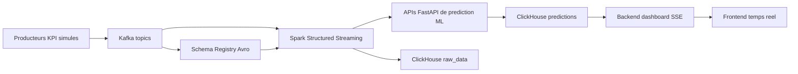

# QoE Analysis Platform

Plateforme de collecte, prediction et visualisation temps reel de la Qualite d'Experience (QoE) pour deux cas d'usage :

- Cloud Gaming
- Video Streaming

Le projet simule des flux KPI, les publie dans Kafka avec des schemas Avro, les traite avec Spark Structured Streaming, appelle des APIs FastAPI de prediction ML, stocke les donnees brutes et les predictions dans ClickHouse, puis affiche les resultats dans un dashboard web temps reel.

## Architecture


Flux logique du projet :



## Fonctionnalites

- Generation continue de KPI pour Cloud Gaming et Video Streaming.
- Serialisation Avro avec Confluent Schema Registry.
- Topics Kafka dedies :
  - `cloud_gaming_kpi`
  - `video_streaming_kpi`
- Traitement streaming avec Spark.
- APIs de prediction QoE exposees avec FastAPI.
- Modeles ML entraines avec scikit-learn et sauvegardes en `.pkl`.
- Stockage ClickHouse en deux couches :
  - `raw_data` pour les KPI bruts.
  - `predictions` pour les scores QoE predits.
- Dashboard web temps reel avec Server-Sent Events (SSE), Chart.js, theme clair/sombre et alertes de degradation QoE.
- Environnement Docker Compose pour Kafka, Schema Registry, Spark, ClickHouse, APIs et dashboard.
- Manifests Kubernetes kind pour le deploiement du dashboard.
- Pipeline Jenkins pour tests, build Docker et deploiement kind.

## Structure du depot

```text
.
|-- api/
|   |-- cloud_gaming/          # API FastAPI de prediction Cloud Gaming
|   `-- video_streaming/       # API FastAPI de prediction Video Streaming
|-- app/
|   |-- backend/               # Backend dashboard, SSE et lecture ClickHouse
|   `-- frontend/              # Dashboard HTML/CSS/JS servi par Nginx
|-- data_ingestion/            # Producteurs Kafka et schemas Avro
|-- data_pipeline/consumers/   # Consumers Spark Structured Streaming
|-- infrastructure/
|   |-- docker/                # Docker Compose et Dockerfile ingestion
|   `-- kind/                  # Configuration Kubernetes kind
|-- ml/
|   |-- config/                # Configurations YAML des datasets et modeles
|   |-- data/                  # Datasets CSV
|   |-- evaluation/            # Evaluation et selection du meilleur modele
|   |-- models/                # Modeles entraines
|   `-- training/              # Script d'entrainement unifie
|-- storage/                   # Scripts SQL d'initialisation ClickHouse
|-- tests/                     # Tests unitaires pytest
|-- Jenkinsfile                # Pipeline CI/CD
`-- README.md
```

## Stack technique

| Couche | Technologies |
| --- | --- |
| Ingestion | Python, Confluent Kafka Producer, Avro, Schema Registry |
| Messaging | Apache Kafka en mode KRaft |
| Streaming | Apache Spark 3.5 Structured Streaming |
| Machine Learning | pandas, scikit-learn, joblib |
| APIs | FastAPI, Uvicorn, Pydantic |
| Stockage analytique | ClickHouse |
| Dashboard | HTML, CSS, JavaScript, Chart.js, Lucide Icons, SSE |
| Conteneurisation | Docker, Docker Compose |
| Orchestration locale | kind, Kubernetes, kubectl |
| CI/CD | Jenkins |
| Tests | pytest, FastAPI TestClient |

## Donnees et variables ML

### Cloud Gaming

Dataset : `ml/data/simulated_4k_cloud_gaming_dataset.csv`

- Nombre d'exemples : 1000
- Cible : `QoE_score`
- Variables :
  - `CPU_usage`
  - `GPU_usage`
  - `Bandwidth_MBps`
  - `Latency_ms`
  - `FrameRate_fps`
  - `Jitter_ms`

Classes QoE :

| Score | Classe |
| --- | --- |
| `< 2` | Poor |
| `>= 2` et `< 3` | Fair |
| `>= 3` et `< 4` | Good |
| `>= 4` | Excellent |

### Video Streaming

Dataset : `ml/data/video - streaming.csv`

- Nombre d'exemples : 20411
- Cible : `mos`
- Variables :
  - `throughput`
  - `avg_bitrate`
  - `delay_qos`
  - `jitter`
  - `packet_loss`

Classes QoE :

| Score | Classe |
| --- | --- |
| `< 2` | Bad |
| `>= 2` et `< 3` | Poor |
| `>= 3` et `< 4` | Fair |
| `>= 4` et `< 4.5` | Good |
| `>= 4.5` | Excellent |

## Prerequis

- Python 3.11 ou plus recent
- Docker
- Docker Compose v2
- Git
- Pour Kubernetes local :
  - kind
  - kubectl
- Pour Jenkins :
  - Jenkins avec acces a Docker, kind et kubectl

## Installation locale Python

Depuis la racine du depot :

```bash
python -m venv .venv
source .venv/bin/activate
pip install --upgrade pip
pip install -r requirements.txt
```

Pour les dependances de test uniquement :

```bash
pip install -r requirements.dev.txt
```

## Entrainement et evaluation des modeles

Le script `ml/training/train.py` entraine plusieurs modeles pour un dataset donne :

- Linear Regression
- ElasticNet
- Random Forest Regressor
- Gradient Boosting Regressor

Entrainer les modeles Cloud Gaming :

```bash
python -m ml.training.train --config cloud_gaming
```

Entrainer les modeles Video Streaming :

```bash
python -m ml.training.train --config video_streaming
```

Evaluer les modeles et conserver le meilleur selon le RMSE :

```bash
python -m ml.evaluation.evaluate --config cloud_gaming
python -m ml.evaluation.evaluate --config video_streaming
```

Les modeles finaux attendus par les APIs sont :

- `ml/models/cloud_gaming_model.pkl`
- `ml/models/video_streaming_model.pkl`

Note : le script d'evaluation sauvegarde le meilleur modele avec le nom final configure et supprime les autres fichiers candidats du meme dataset.

## Demarrage avec Docker Compose

Les fichiers Compose utilisent le reseau Docker externe `app-tier`. Cree-le une fois avant de demarrer les services :

```bash
docker network create app-tier
```

Si le reseau existe deja, l'erreur peut etre ignoree.

### 1. Demarrer ClickHouse

```bash
docker compose -f infrastructure/docker/docker-compose.clickhouse.yaml up -d
```

Les scripts SQL du dossier `storage/` sont montes dans `/docker-entrypoint-initdb.d` et creent automatiquement :

- `raw_data.cloud_gaming_raw`
- `raw_data.video_streaming_raw`
- `predictions.cloud_gaming_predictions`
- `predictions.video_streaming_predictions`

### 2. Demarrer Kafka, Schema Registry et les producteurs

```bash
docker compose -f infrastructure/docker/docker-compose.kafka.yaml up -d --build
```

Services principaux :

- Kafka : `kafka-0-s:9092`
- Schema Registry : `http://schema-registry:8081`
- Kafka UI : `http://localhost:8088`
- Schema Registry local : `http://localhost:9081`

Le service `kafka-producer` cree les topics puis publie un message par seconde pour chaque cas d'usage.

### 3. Demarrer les APIs de prediction

```bash
docker compose -f infrastructure/docker/docker-compose.api.yaml up -d --build
```

Endpoints locaux :

- Cloud Gaming API : `http://localhost:8001`
- Video Streaming API : `http://localhost:8002`

Documentation Swagger :

- `http://localhost:8001/docs`
- `http://localhost:8002/docs`

### 4. Demarrer Spark et les consumers streaming

```bash
docker compose -f infrastructure/docker/docker-compose.spark.yaml up -d
```

Services utiles :

- Spark Master UI : `http://localhost:8083`
- Spark Worker UI : `http://localhost:8082`
- Cloud Gaming Spark UI : `http://localhost:4040`
- Video Streaming Spark UI : `http://localhost:4041`

Les consumers Spark lisent Kafka, deserialisent Avro, ecrivent les KPI bruts dans ClickHouse, appellent les APIs de prediction, puis stockent les predictions.

### 5. Demarrer le dashboard

```bash
docker compose -f infrastructure/docker/docker-compose.app.yaml up -d --build
```

Dashboard :

```text
http://localhost:8080
```

Le frontend Nginx proxifie `/api/` vers le backend dashboard. Le backend expose les flux SSE :

- `/api/stream/cloud-gaming`
- `/api/stream/video-streaming`

## URLs et ports

| Service | URL locale | Description |
| --- | --- | --- |
| Dashboard | `http://localhost:8080` | Interface temps reel |
| Backend dashboard | interne Docker `backend:8000` | Flux SSE depuis ClickHouse |
| Cloud Gaming API | `http://localhost:8001` | Prediction QoE Cloud Gaming |
| Video Streaming API | `http://localhost:8002` | Prediction QoE Video Streaming |
| Kafka UI | `http://localhost:8088` | Inspection Kafka |
| Schema Registry | `http://localhost:9081` | Schemas Avro |
| ClickHouse HTTP | `http://localhost:8123` | API HTTP ClickHouse |
| ClickHouse UI | `http://localhost:5521` | Interface ClickHouse |
| Spark Master | `http://localhost:8083` | Cluster Spark |
| Spark Worker | `http://localhost:8082` | Worker Spark |

Identifiants ClickHouse de developpement :

```text
user: qoe_user
password: qoe_password
```

## APIs de prediction

### Cloud Gaming

Health check :

```bash
curl http://localhost:8001/health
```

Prediction :

```bash
curl -X POST http://localhost:8001/predict \
  -H "Content-Type: application/json" \
  -d '{
    "CPU_usage": 50,
    "GPU_usage": 40,
    "Bandwidth_MBps": 25.5,
    "Latency_ms": 35,
    "FrameRate_fps": 60,
    "Jitter_ms": 3
  }'
```

Reponse :

```json
{
  "qoe_score": 3.7,
  "qoe_class": "Good"
}
```

### Video Streaming

Health check :

```bash
curl http://localhost:8002/health
```

Prediction :

```bash
curl -X POST http://localhost:8002/predict \
  -H "Content-Type: application/json" \
  -d '{
    "throughput": 2000,
    "avg_bitrate": 1500,
    "delay_qos": 50,
    "jitter": 5,
    "packet_loss": 0
  }'
```

Reponse :

```json
{
  "qoe_score": 4.6,
  "qoe_class": "Excellent"
}
```

## Schema ClickHouse

Le projet cree deux bases principales :

- `raw_data`
- `predictions`

Tables brutes :

- `raw_data.cloud_gaming_raw`
- `raw_data.video_streaming_raw`

Tables de prediction :

- `predictions.cloud_gaming_predictions`
- `predictions.video_streaming_predictions`

Les tables utilisent le moteur `MergeTree`, sont partitionnees par mois avec `toYYYYMM(ingestion_timestamp)` et ordonnees par `(ingestion_timestamp, id)`.

## Deploiement Kubernetes avec kind

Le dossier `infrastructure/kind/` contient une configuration locale kind et les manifests du dashboard.

Creer le cluster :

```bash
kind create cluster --name qoe --config infrastructure/kind/kind-config.yaml
```

Builder les images dashboard :

```bash
docker build -t qoe/dashboard-backend:dev ./app/backend
docker build -t qoe/dashboard-frontend:dev ./app/frontend
```

Charger les images dans kind :

```bash
kind load docker-image qoe/dashboard-backend:dev --name qoe
kind load docker-image qoe/dashboard-frontend:dev --name qoe
```

Deployer :

```bash
kubectl create namespace qoe
kubectl apply -f infrastructure/kind/app/backend.yaml
kubectl apply -f infrastructure/kind/app/frontend.yaml
```

Acceder au frontend :

```bash
kubectl port-forward -n qoe svc/frontend 8090:80
```

URL :

```text
http://localhost:8090
```

Le script `port.sh` lance aussi ce port-forward.

## Tests

Lancer les tests :

```bash
pytest
```

Les tests couvrent :

- Le chargement des configurations ML.
- La creation des modeles supportes.
- Les mappings score QoE vers classe.
- Les endpoints `/health` et `/predict` des APIs.
- La validation Pydantic des payloads API.

## CI/CD Jenkins

Le `Jenkinsfile` execute les etapes suivantes :

1. Verification des outils (`docker`, `kind`, `kubectl`).
2. Checkout du depot GitHub.
3. Creation de l'environnement virtuel Python.
4. Installation des dependances de test.
5. Execution de `pytest tests/`.
6. Build des images dashboard backend et frontend.
7. Chargement des images dans le cluster kind.
8. Deploiement Kubernetes dans le namespace `qoe`.
9. Verification des pods et services.
10. Notification email en cas de succes ou d'echec.

## Configuration importante

Variables et chemins utilises par les services :

| Element | Valeur par defaut |
| --- | --- |
| Modele Cloud Gaming | `/app/models/cloud_gaming_model.pkl` |
| Modele Video Streaming | `/app/models/video_streaming_model.pkl` |
| Variable API modele | `MODEL_PATH` |
| Kafka bootstrap interne | `kafka-0-s:9092` |
| Schema Registry interne | `http://schema-registry:8081` |
| ClickHouse interne | `clickhouse:8123` |
| ClickHouse dashboard backend | `host.docker.internal:8123` |
| Database ClickHouse raw | `raw_data` |
| Database ClickHouse predictions | `predictions` |

## Arret des services Docker

Arreter les stacks Compose :

```bash
docker compose -f infrastructure/docker/docker-compose.app.yaml down
docker compose -f infrastructure/docker/docker-compose.spark.yaml down
docker compose -f infrastructure/docker/docker-compose.api.yaml down
docker compose -f infrastructure/docker/docker-compose.kafka.yaml down
docker compose -f infrastructure/docker/docker-compose.clickhouse.yaml down
```

Pour supprimer aussi les volumes persistants, ajouter `-v` aux commandes `down`.

## Notes de developpement

- Les credentials ClickHouse inclus sont destines au developpement local.
- Les producteurs generent des donnees synthetiques aleatoires.
- Les modeles `.pkl` sont charges au demarrage des APIs.
- Le backend dashboard lit les tables `predictions.*` et diffuse uniquement les nouvelles lignes via SSE.
- Les endpoints frontend sont relatifs (`/api/...`) afin de passer par le proxy Nginx.